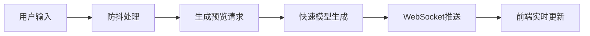
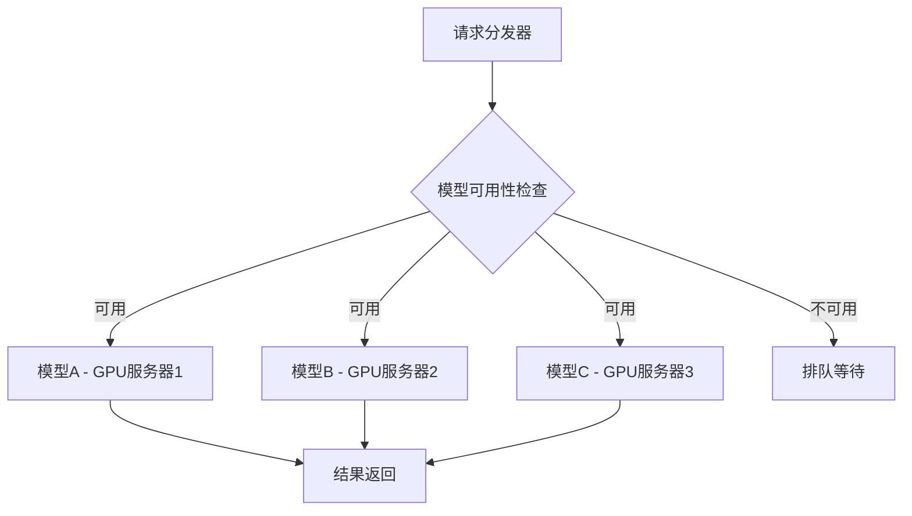

# AI画布工具功能缺失分析与后端设计

## 概览

基于现有前端代码和产品需求文档分析，当前AI画布工具主要实现了基础的绘图功能，但缺少核心的AI功能、数据持久化和完整的用户体验。本文档将系统梳理缺失功能并设计后端架构来支撑完整的产品功能。

## 技术栈分析

### 当前前端实现
- **框架**: React + Hooks
- **渲染**: HTML5 Canvas + 手动渲染
- **状态管理**: 本地状态（useState）
- **功能**: 基础绘图工具、图层管理、撤销重做、画布变换

### 推荐后端技术栈
- **API框架**: Node.js + Express 或 Python + FastAPI
- **数据库**: MongoDB（文档存储）+ Redis（缓存）
- **文件存储**: AWS S3 或阿里云OSS
- **AI服务**: 集成多个AI绘图API（Stable Diffusion、DALL-E等）

## 功能缺失分析

### 1. 核心AI功能缺失

| 功能模块 | 产品需求 | 当前状态 | 优先级 |
|----------|----------|----------|--------|
| 文本生成图像 | 支持800字以内描述生成图像 | ❌ 未实现 | 🔴 高 |
| 图生图功能 | 参考图像生成新图像 | ❌ 未实现 | 🔴 高 |
| 多模型支持 | 提供多种生成模型选择 | ❌ 未实现 | 🟡 中 |
| 参考强度控制 | 可调节参考图像影响程度 | ❌ 未实现 | 🟡 中 |
| AI编辑工具 | 局部重绘、扩图、细节修改 | ❌ 未实现 | 🔴 高 |

### 2. 数据持久化缺失

| 功能模块 | 产品需求 | 当前状态 | 优先级 |
|----------|----------|----------|--------|
| 图像上传 | 支持PNG/JPG/WEBP格式 | ❌ 未实现 | 🔴 高 |
| 项目保存 | 画布状态、图层数据保存 | ❌ 未实现 | 🔴 高 |
| 生成记录 | 历史生成图像记录管理 | ❌ 未实现 | 🟡 中 |
| 云端同步 | 跨设备数据同步 | ❌ 未实现 | 🟢 低 |

### 3. 高级编辑功能缺失

| 功能模块 | 产品需求 | 当前状态 | 优先级 |
|----------|----------|----------|--------|
| 选择工具 | 框选、套索选择 | ❌ 未实现 | 🔴 高 |
| 文本工具 | 画布文本添加编辑 | ❌ 未实现 | 🟡 中 |
| 智能画笔 | 自动识别绘画意图 | ❌ 未实现 | 🟢 低 |
| HD超分 | 图像分辨率提升 | ❌ 未实现 | 🟡 中 |
| 智能抠图 | 自动背景移除 | ❌ 未实现 | 🟡 中 |

### 4. 用户体验功能缺失

| 功能模块 | 产品需求 | 当前状态 | 优先级 |
|----------|----------|----------|--------|
| 实时预览 | 生成过程实时反馈 | ❌ 未实现 | 🔴 高 |
| 画布缩放平移 | 完整的画布导航 | ✅ 基础实现 | 🟡 优化 |
| 工具栏UI | 完整的工具界面 | ❌ 未实现 | 🔴 高 |
| 图像导出 | 多格式导出功能 | ❌ 未实现 | 🔴 高 |

## 后端架构设计

### 系统架构图

``mermaid
graph TB
    subgraph "客户端层"
        A[React前端应用]
        B[Canvas渲染引擎]
        C[状态管理]
    end
    
    subgraph "API网关层"
        D[负载均衡器]
        E[API网关]
        F[身份认证]
    end
    
    subgraph "业务服务层"
        G[用户服务]
        H[项目管理服务]
        I[AI生成服务]
        J[文件处理服务]
        K[实时通信服务]
    end
    
    subgraph "AI处理层"
        L[模型调度器]
        M[Stable Diffusion API]
        N[DALL-E API]
        O[自定义模型服务]
    end
    
    subgraph "数据存储层"
        P[MongoDB]
        Q[Redis缓存]
        R[文件存储OSS]
    end
    
    A --> D
    D --> E
    E --> F
    F --> G
    F --> H
    F --> I
    F --> J
    F --> K
    
    I --> L
    L --> M
    L --> N
    L --> O
    
    G --> P
    H --> P
    I --> Q
    J --> R
```

### 核心服务设计

#### 1. 用户服务 (User Service)

**职责**: 用户认证、权限管理、个人设置

**核心功能**:
- 用户注册登录
- JWT令牌管理
- 用户偏好设置
- 使用量统计

**数据模型**:
```
User {
  id: ObjectId
  email: String
  username: String
  avatar: String
  subscription: {
    plan: String
    usage: {
      daily_generations: Number
      storage_used: Number
    }
  }
  preferences: {
    default_model: String
    canvas_settings: Object
  }
  created_at: Date
}
```

#### 2. 项目管理服务 (Project Service)

**职责**: 画布项目的CRUD操作、版本管理

**核心功能**:
- 项目创建、保存、加载
- 图层数据管理
- 历史版本控制
- 项目分享权限

**数据模型**:
```
Project {
  id: ObjectId
  user_id: ObjectId
  name: String
  canvas_data: {
    width: Number
    height: Number
    background: String
    layers: [Layer]
    transform: Transform
  }
  metadata: {
    created_at: Date
    updated_at: Date
    thumbnail: String
    tags: [String]
  }
  sharing: {
    is_public: Boolean
    shared_users: [ObjectId]
  }
}

Layer {
  id: String
  name: String
  visible: Boolean
  locked: Boolean
  opacity: Number
  objects: [DrawObject]
  thumbnail: String
}
```

#### 3. AI生成服务 (AI Generation Service)

**职责**: AI图像生成、模型管理、任务调度

**核心功能**:
- 文本到图像生成
- 图像到图像转换
- 模型选择和参数配置
- 生成任务队列管理
- 结果缓存策略

**API接口设计**:

| 接口 | 方法 | 描述 |
|------|------|------|
| `/api/generate/text-to-image` | POST | 文本生成图像 |
| `/api/generate/image-to-image` | POST | 图生图功能 |
| `/api/generate/inpaint` | POST | 局部重绘 |
| `/api/generate/upscale` | POST | 图像超分 |
| `/api/models` | GET | 获取可用模型列表 |
| `/api/generation/status/{taskId}` | GET | 查询生成状态 |

**生成任务流程**:

``mermaid
sequenceDiagram
    participant C as 客户端
    participant A as API网关
    participant G as 生成服务
    participant M as 模型调度器
    participant D as 数据库
    participant S as 存储服务
    
    C->>A: 提交生成请求
    A->>G: 转发请求
    G->>D: 创建任务记录
    G->>M: 调度AI模型
    G->>C: 返回任务ID
    
    loop 轮询状态
        C->>G: 查询任务状态
        G->>C: 返回状态信息
    end
    
    M->>G: 生成完成回调
    G->>S: 保存生成图像
    G->>D: 更新任务状态
    
    C->>G: 获取最终结果
    G->>C: 返回图像URL
```

#### 4. 文件处理服务 (File Service)

**职责**: 文件上传、格式转换、存储管理

**核心功能**:
- 多格式图像上传
- 图像压缩和格式转换
- 缩略图生成
- CDN分发管理

**处理流程**:

``mermaid
flowchart TD
    A[文件上传] --> B{文件类型检查}
    B -->|图像文件| C[病毒扫描]
    B -->|非法格式| D[拒绝上传]
    C --> E[格式转换]
    E --> F[压缩处理]
    F --> G[生成缩略图]
    G --> H[上传到OSS]
    H --> I[返回访问URL]
```

#### 5. 实时通信服务 (WebSocket Service)

**职责**: 实时状态推送、协作功能

**核心功能**:
- 生成进度实时推送
- 多用户协作画布
- 系统通知推送

### 数据库设计

#### MongoDB集合结构

```
Canvas_Platform/
├── users/           # 用户信息
├── projects/        # 项目数据
├── generations/     # 生成任务记录
├── models/          # AI模型配置
├── templates/       # 模板库
└── usage_logs/      # 使用统计
```

#### Redis缓存策略

| 缓存类型 | Key模式 | TTL | 用途 |
|----------|---------|-----|------|
| 用户会话 | `session:{userId}` | 24h | JWT令牌验证 |
| 生成任务 | `task:{taskId}` | 1h | 任务状态缓存 |
| 模型配置 | `model:{modelId}` | 12h | 模型参数缓存 |
| 项目缓存 | `project:{projectId}` | 30m | 频繁访问项目 |

## API接口规范

### 认证机制

所有API请求需要在Header中携带JWT令牌：
```
Authorization: Bearer <jwt_token>
```

### 请求响应格式

**统一响应结构**:
```json
{
  "success": true,
  "code": 200,
  "message": "操作成功",
  "data": {},
  "timestamp": 1640995200000
}
```

**错误响应格式**:
```json
{
  "success": false,
  "code": 400,
  "message": "参数错误",
  "error": "详细错误信息",
  "timestamp": 1640995200000
}
```

### 核心API端点

#### 项目管理API

| 接口 | 方法 | 描述 | 参数 |
|------|------|------|------|
| `/api/projects` | GET | 获取用户项目列表 | page, limit, search |
| `/api/projects` | POST | 创建新项目 | name, canvas_data |
| `/api/projects/{id}` | GET | 获取项目详情 | - |
| `/api/projects/{id}` | PUT | 更新项目 | canvas_data |
| `/api/projects/{id}` | DELETE | 删除项目 | - |

#### 文件管理API

| 接口 | 方法 | 描述 | 参数 |
|------|------|------|------|
| `/api/files/upload` | POST | 上传文件 | file, type |
| `/api/files/{id}` | GET | 获取文件信息 | - |
| `/api/files/{id}/download` | GET | 下载文件 | format |

#### AI生成API

| 接口 | 方法 | 描述 | 参数 |
|------|------|------|------|
| `/api/ai/text-to-image` | POST | 文本生成图像 | prompt, model, size |
| `/api/ai/image-to-image` | POST | 图生图 | image, prompt, strength |
| `/api/ai/inpaint` | POST | 局部重绘 | image, mask, prompt |

## 技术实现要点

### 1. 实时预览机制



### 2. 文件存储策略

- **原图存储**: OSS永久存储，支持CDN加速
- **缩略图**: 多尺寸自动生成，Redis缓存热点图片
- **临时文件**: 本地临时存储，定时清理

### 3. AI模型负载均衡



### 4. 数据安全措施

- **传输加密**: 全站HTTPS，API请求加密
- **存储加密**: 敏感数据AES加密存储
- **访问控制**: 基于角色的权限管理
- **隐私保护**: 用户数据本地化处理选项

## 性能优化策略

### 1. 缓存优化

- **多级缓存**: 浏览器缓存 + CDN缓存 + Redis缓存
- **智能预缓存**: 根据用户习惯预加载常用模型
- **缓存更新**: 版本化缓存键，支持热更新

### 2. 数据库优化

- **索引策略**: 用户ID、项目ID、创建时间等关键字段建索引
- **分片策略**: 按用户ID分片，支持水平扩展
- **读写分离**: 主从复制，读操作负载均衡

### 3. AI服务优化

- **模型预热**: 常用模型常驻内存
- **批处理**: 相似请求批量处理
- **结果缓存**: 相同参数结果复用

## 测试策略

### 单元测试覆盖

- **服务层测试**: 业务逻辑单元测试，覆盖率 > 80%
- **API测试**: 接口功能和边界条件测试
- **数据层测试**: 数据模型和查询逻辑测试

### 集成测试

- **端到端测试**: 用户完整操作流程测试
- **性能测试**: 并发用户和大文件处理测试
- **AI模型测试**: 生成质量和速度基准测试
