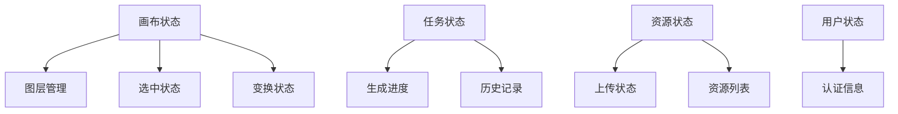
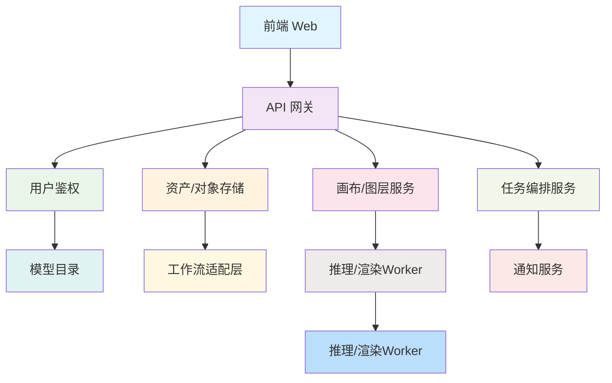
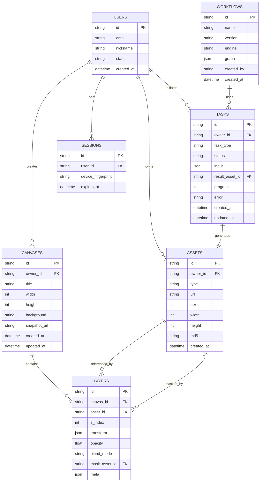

# AI图像生成平台产品设计与开发方案

## 1. 概述

本方案旨在提供一个AI图像生成平台的完整产品设计与开发流程，涵盖从需求分析到产品上线的完整生命周期。该平台支持多图层编辑、AI图像生成、局部重绘、扩图、消除笔、细节修复等功能。

### 1.1 目标与原则

**低门槛可用**：前端交互顺滑、零插件上手；后端提供清晰的任务编排与回调机制。

**强可控生成**：多参考图、蒙版、分层参数、风格参考等均可作为模型输入。

**工程可维护**：前后端解耦，任务异步化、幂等、可重试；日志、指标可观测。

**便于横向扩展**：推理节点水平扩容，多模型/多工作流热更新；对象存储与CDN分发。

### 1.2 适用范围
- AI图像生成Web应用程序开发
- 前后端分离架构项目
- 需要高性能GPU推理的图像处理平台

## 2. 前端架构设计

### 2.1 技术栈选择

**Vue方案（推荐）**
- 框架：Vue 3 + Vite
- 路由管理：Vue Router
- 状态管理：Pinia
- 画布库：vue-konva (Konva)
- UI组件库：Element Plus 或 Arco Design Vue
- HTTP客户端：Axios

**React方案（备选）**
- 框架：React 18 + Vite
- 路由管理：React Router
- 状态管理：Zustand
- 画布库：react-konva (Konva) 或 Fabric.js
- UI组件库：Arco Design React
- HTTP客户端：Axios

选择建议：Konva在"多图层变换/命中测试/事件模型"上更省心；Fabric在滤镜/Path编辑方面生态更全。根据PRD偏"多图层+蒙版笔刷+导出合成"，建议首选 Konva。

### 2.2 组件架构
- AppShell组件：顶栏、侧栏、路由入口（登录态守卫）
- CanvasView组件：画布主视图，包含Konva容器、缩放/网格/吸附
- LayerPanel组件：图层列表（显示缩略图、锁定/隐藏/混合模式/不透明度、拖拽排序）
- Toolbox组件：工具条(局部重绘/扩图/抠图/消除笔/细节修复)
- ReferencePanel组件：参考图/风格参考管理
- TaskPanel组件：任务列表/生成历史
- AssetBrowser组件：资源浏览/上传
- ExportDialog组件：导出参数设置

### 2.3 状态管理设计


### 2.4 页面路由结构
- 画布编辑页面 (/canvas/:id)
- 任务历史页面 (/tasks)
- 资源管理页面 (/assets)
- 用户登录页面 (/auth/login)
- 用户注册页面 (/auth/register)

## 3. 后端架构设计

### 3.1 技术栈选择

**语言与框架选择（二选一）**
- TypeScript (NestJS)：更适合大型 BFF/网关聚合、装饰器式校验、组织规范
- Python (FastAPI)：原生友好、科学计算及图像处理扩展更顺手

**基础设施**
- 数据库：PostgreSQL（主），SQL 建模清晰；可选 Read Replica
- 缓存/队列：Redis（RPOPLPUSH/BullMQ/Celery）
- 对象存储：MinIO（私有化）/ S3（公有云），配 预签名URL
- 消息队列：Redis 或 Kafka
- API文档：Swagger / OpenAPI

### 3.2 总体架构


### 3.3 核心服务模块

**用户鉴权服务**
- OIDC/JWT（/auth/login, /auth/refresh, /auth/logout）
- 权限：系统管理员、普通用户
- 安全：短期 JWT + Refresh Token，后端黑名单、设备指纹

**资产/对象存储服务**
- 资产类型：原图、参考图、蒙版、风格参考、导出图、工作流文件
- 上传流程：前端向后端请求预签名URL → 前端直传对象存储 → 回写元数据

**画布/图层服务**
- 画布：管理多图层与布局，保存为结构化 JSON
- 图层：引用资产ID、位置矩阵、透明度、混合模式、蒙版

**任务编排服务**
- 任务类型：混合生图、局部重绘、扩图、消除笔、细节修复、超分等
- 执行：Orchestrator 将请求标准化 → 下发到指定 Workflow Adapter → 推理 Worker
- 回调：Worker 推送进度/中间图/结果 → 通知服务 → 前端渲染

### 3.4 数据库设计


## 4. 前后端交互设计

### 4.1 接口通信协议
- HTTP/HTTPS协议
- JSON数据格式
- RESTful API规范
- WebSocket/SSE长连接（用于任务进度推送）

### 4.2 认证与授权
- JWT Token认证（短期 JWT + Refresh Token）
- OIDC认证
- RBAC权限控制（系统管理员、普通用户）

### 4.3 数据传输安全
- HTTPS加密传输
- 敏感数据加密存储
- 输入数据验证与过滤
- CORS跨域资源共享控制
- 预签名URL（用于对象存储直传）

## 5. 核心业务模块设计

### 5.1 账号与鉴权
- OIDC/JWT（/auth/login, /auth/refresh, /auth/logout）
- 权限：系统管理员、普通用户（可后续扩展租户/角色）
- 安全：短期 JWT + Refresh Token，后端黑名单、设备指纹（可选）

### 5.2 资产/对象存储
- 资产类型：原图、参考图、蒙版、风格参考、导出图、工作流文件
- 上传流程：前端向后端请求 /asset/presign → 前端直传对象存储 → 回写元数据
- 版本：同一资源支持版本记录（可选）

### 5.3 画布与图层
- 画布：一个画布管理多图层与布局，保存为结构化 JSON（便于快照与回滚）
- 图层：引用资产ID、位置矩阵、透明度、混合模式、蒙版（点阵或矢量路径）
- 组合导出：服务端/前端合成（前端做预览，服务端做高分辨率导出）

### 5.4 生成任务与编排
- 任务类型：混合生图、局部重绘、扩图、消除笔、细节修复、超分等
- 输入：层选择（单层/多层/整个画布）、参考图、蒙版、描述词、风格参考、参数
- 执行：Orchestrator 将请求标准化 → 下发到指定 Workflow Adapter → 推理 Worker
- 回调：Worker 推送进度/中间图/结果 → 通知服务（WS/SSE）→ 前端渲染
- 幂等：task_idempotent_key；失败自动重试（指数退避）

## 6. API设计

### 6.1 资产相关接口
- POST /asset/presign → { key, url, headers }（前端直传）
- POST /asset/complete → 写入元数据（宽高/MD5/类型）
- GET /asset/:id → 元数据信息
- DELETE /asset/:id

### 6.2 画布/图层接口
- POST /canvas → 创建（传 width/height/background）
- GET /canvas/:id → 读取（含层列表或分页）
- PATCH /canvas/:id → 更新画布属性
- POST /canvas/:id/layers → 批量新增/更新/重排
- DELETE /canvas/:id/layers/:layerId

### 6.3 生成任务接口
- POST /task
- GET /task/:id
- GET /task/stream/:id → SSE 流（文本进度/中间图 URL）
- POST /task/cancel/:id

### 6.4 导出接口
- POST /export/canvas → { canvas_id, format: "png|psd|zip", dpi, flatten?:false }
- 结果通过 result_asset_id 返回；PSDs 由服务端拼装（图层/蒙版）

## 7. 工作流适配与推理层

### 7.1 Workflow Adapter
- 适配 ComfyUI（REST/WebSocket）或自研推理服务
- 将任务输入转换为底层工作流图（graph json）/参数
- 维护可配置工作流模板（版本化）：/workflow/:name/:version
- 支持 "节点拼装 + 参数覆盖 + 资源注入（参考图/蒙版/层合成图）"

### 7.2 推理/渲染 Worker
- 镜像内置：PyTorch + 必需模型（或冷启拉取至本地缓存）
- 前处理：剪裁/缩放/对齐、蒙版矫正、图层合成为输入
- 后处理：细节增强、去噪、去伪影、色域/ICC（可选）、安全审查（可选）
- 性能：NVIDIA GPU，混合精度、批处理，避免显存碎片
- 调度：按模型类型/显存需求进行队列隔离


## 8. 前端页面/组件拆分

### 8.1 核心页面组件
- AppShell：顶栏、侧栏、路由入口（登录态守卫）
- CanvasView：Konva/Fabric 容器、缩放/网格/吸附、选择、对齐、变换、裁剪、蒙版笔刷
- LayerPanel：图层列表（显示缩略图、锁定/隐藏/混合模式/不透明度、拖拽排序）
- Toolbox：局部重绘/扩图/消除笔/细节修复/超分；参数抽屉
- ReferencePanel：参考图/风格参考管理
- TaskPanel：实时进度、预览帧、历史记录，一键回滚成新图层
- AssetBrowser：我的资源（按用途/时间/标签检索）
- ExportDialog：PNG/PSD 导出参数；导出历史

### 8.2 交互建议
- 任务执行时锁定相关图层（避免并发修改），完成后以新图层形式注入，确保可回退
- 参数面板支持收藏预设；图层右键支持"以此为输入生成"


## 9. 项目结构参考

### 9.1 前端项目结构
```
/frontend
  /src
    /views
      CanvasView.vue         # Konva 容器，画布主逻辑
      TasksView.vue
    /components
      LayerPanel.vue
      Toolbox.vue
      ParamsDrawer.vue
      AssetBrowser.vue
    /stores
      canvas.ts              # 画布/图层状态
      tasks.ts               # 任务状态/轮询
    /api
      http.ts                # axios 实例与拦截器
      asset.ts, canvas.ts, task.ts
    /utils/konva.ts
    main.ts, router.ts
```

### 9.2 后端项目结构
```
/backend (NestJS)
  /apps/api
    /modules
      auth, asset, canvas, task, workflow, notifier
    main.ts
  /apps/orchestrator
    index.ts                 # 队列消费/派发/回调
  /libs
    prisma (或 typeorm), common, dto
  docker-compose.yml
```


