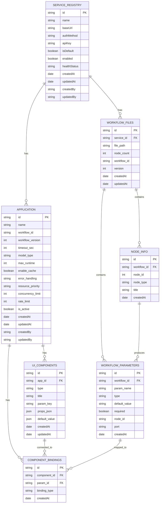

# 系统逻辑与数据结构

## 1. 数据实体关系

## 2. 关键表结构

### SERVICE_REGISTRY (服务注册表)
| 字段名 | 类型 | 说明 |
|--------|------|------|
| id | String | 主键 |
| name | String | 服务名称 |
| baseUrl | String | 基础URL |
| authMethod | String | 认证方式 (none, header, query) |
| apiKey | String | API密钥 |
| isDefault | Boolean | 是否为默认服务 |
| enabled | Boolean | 是否启用 |
| healthStatus | String | 健康状态 (unknown, healthy, unhealthy) |
| createdAt | Date | 创建时间 |
| updatedAt | Date | 更新时间 |
| createdBy | String | 创建人 |
| updatedBy | String | 更新人 |

### WORKFLOW_FILES (工作流文件)
| 字段名 | 类型 | 说明 |
|--------|------|------|
| id | String | 主键 |
| service_id | String | 关联的服务ID |
| file_path | String | 文件路径 |
| node_count | Integer | 节点数量 |
| workflow_id | String | 工作流ID |
| version | Integer | 版本号 |
| createdAt | Date | 创建时间 |
| updatedAt | Date | 更新时间 |

### WORKFLOW_PARAMETERS (工作流参数)
| 字段名 | 类型 | 说明 |
|--------|------|------|
| id | String | 主键 |
| workflow_id | String | 关联的工作流ID |
| param_name | String | 参数名 |
| type | String | 参数类型 |
| default_value | String | 默认值 |
| required | Boolean | 是否必填 |
| node_id | String | 节点ID |
| port | String | 端口 |
| createdAt | Date | 创建时间 |

### NODE_INFO (节点信息)
| 字段名 | 类型 | 说明 |
|--------|------|------|
| id | String | 主键 |
| workflow_id | String | 关联的工作流ID |
| node_id | Integer | 节点ID |
| node_type | String | 节点类型 |
| title | String | 节点标题 |
| createdAt | Date | 创建时间 |

### APPLICATION (应用配置)
| 字段名 | 类型 | 说明 |
|--------|------|------|
| id | String | 主键 |
| name | String | 应用名称 |
| workflow_id | String | 关联的工作流ID |
| workflow_version | Integer | 工作流版本 |
| timeout_sec | Integer | 超时时间(秒) |
| model_type | String | 模型类型 (SD, FLUX, OTHER) |
| max_runtime | Integer | 最大运行时间 |
| enable_cache | Boolean | 是否启用缓存 |
| error_handling | String | 错误处理策略 (retry, fallback, fail) |
| resource_priority | String | 资源优先级 (GPU, CPU, AUTO) |
| concurrency_limit | Integer | 并发限制 |
| rate_limit | Integer | 速率限制 |
| is_active | Boolean | 是否激活 |
| createdAt | Date | 创建时间 |
| updatedAt | Date | 更新时间 |
| createdBy | String | 创建人 |
| updatedBy | String | 更新人 |

### UI_COMPONENTS (UI组件)
| 字段名 | 类型 | 说明 |
|--------|------|------|
| id | String | 主键 |
| app_id | String | 关联的应用ID |
| type | String | 组件类型 |
| title | String | 组件标题 |
| param_key | String | 参数名 |
| props_json | JSON | 组件属性 |
| default_value | JSON | 默认值 |
| createdAt | Date | 创建时间 |
| updatedAt | Date | 更新时间 |

### COMPONENT_BINDINGS (组件绑定关系)
| 字段名 | 类型 | 说明 |
|--------|------|------|
| id | String | 主键 |
| component_id | String | 关联的组件ID |
| param_id | String | 关联的参数ID |
| binding_type | String | 绑定类型 |
| createdAt | Date | 创建时间 |

### EXECUTION_HISTORY (执行历史)
| 字段名 | 类型 | 说明 |
|--------|------|------|
| id | String | 主键 |
| app_id | String | 关联的应用ID |
| request_id | String | 请求ID |
| status | String | 状态 (pending, processing, success, failed) |
| inputs | JSON | 输入参数 |
| outputs | JSON | 输出结果 |
| error | String | 错误信息 |
| duration_ms | Integer | 执行耗时(毫秒) |
| createdBy | String | 创建人 |
| createdAt | Date | 创建时间 |
| updatedAt | Date | 更新时间 |