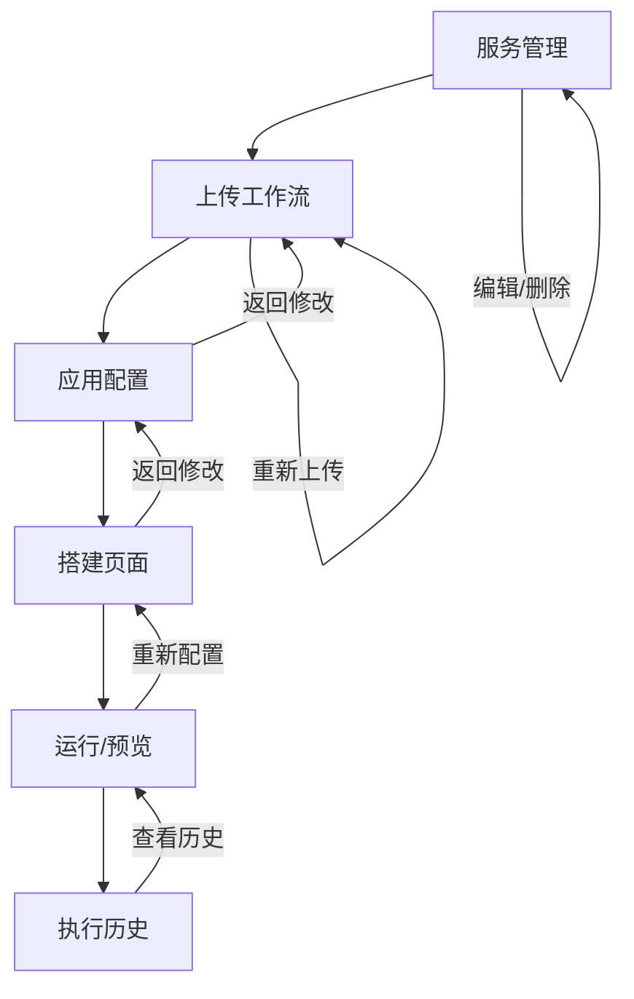
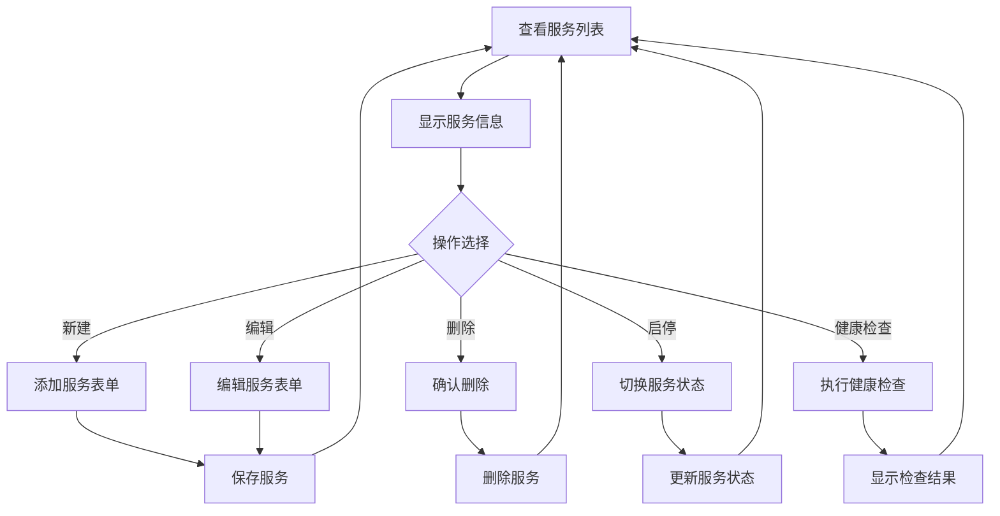
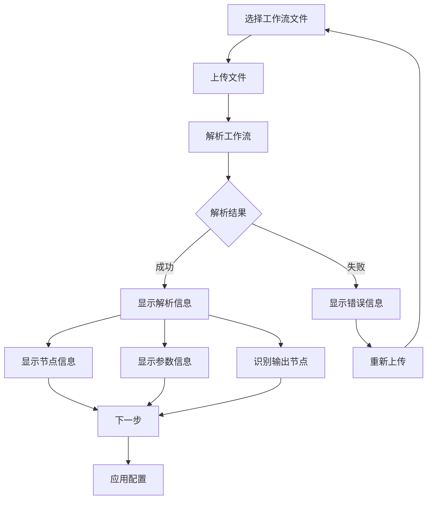
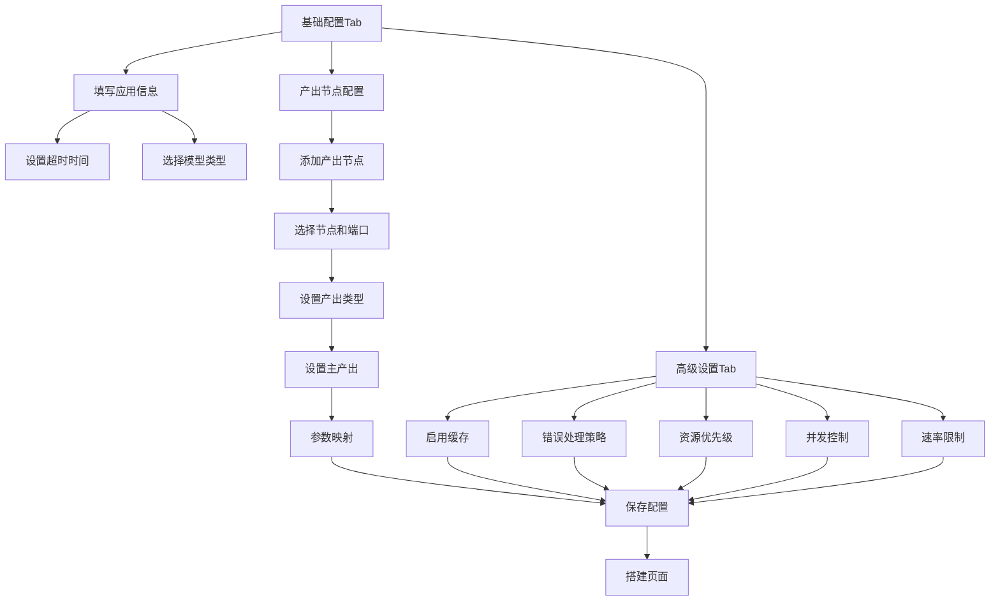
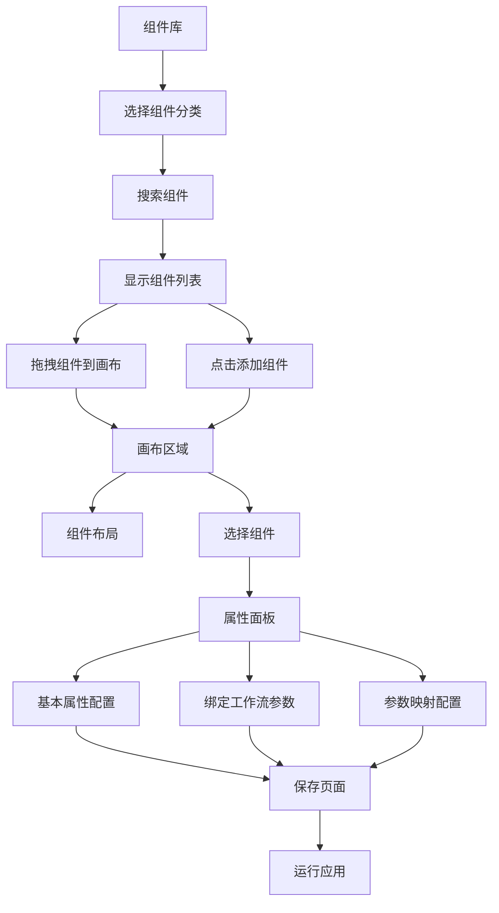
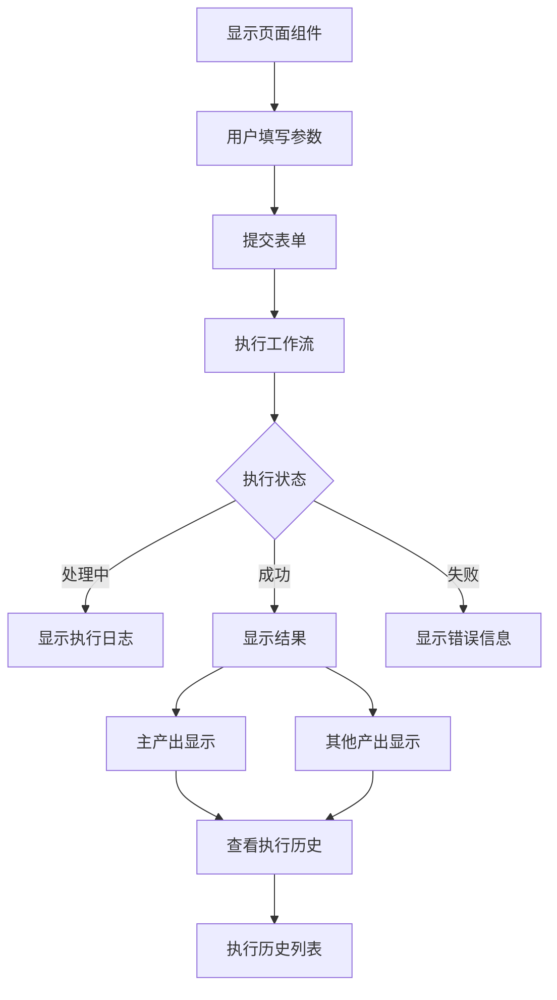
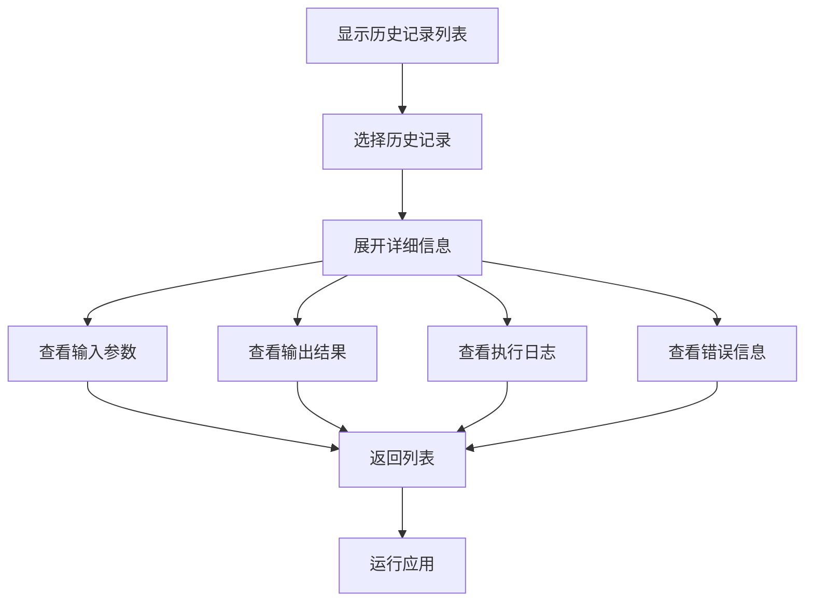

# 交互逻辑图

## 总体流程

```mermaid
graph TD
    A[服务管理] --> B[上传工作流]
    B --> C[应用配置]
    C --> D[搭建页面]
    D --> E[运行/预览]
    E --> F[执行历史]
    
    A -->|编辑/删除| A
    B -->|重新上传| B
    C -->|返回修改| B
    D -->|返回修改| C
    E -->|重新配置| D
    F -->|查看历史| E
```

## 详细交互流程

### 1. 服务管理流程

```mermaid
graph TD
    SM1[查看服务列表] --> SM2[显示服务信息]
    SM2 --> SM3{操作选择}
    SM3 -->|新建| SM4[添加服务表单]
    SM3 -->|编辑| SM5[编辑服务表单]
    SM3 -->|删除| SM6[确认删除]
    SM3 -->|启停| SM7[切换服务状态]
    SM3 -->|健康检查| SM8[执行健康检查]
    
    SM4 --> SM9[保存服务]
    SM5 --> SM9
    SM6 --> SM10[删除服务]
    SM7 --> SM11[更新服务状态]
    SM8 --> SM12[显示检查结果]
    
    SM9 --> SM1
    SM10 --> SM1
    SM11 --> SM1
    SM12 --> SM1
```

### 2. 上传工作流流程

```mermaid
graph TD
    UW1[选择工作流文件] --> UW2[上传文件]
    UW2 --> UW3[解析工作流]
    UW3 --> UW4{解析结果}
    UW4 -->|成功| UW5[显示解析信息]
    UW4 -->|失败| UW6[显示错误信息]
    
    UW5 --> UW7[显示节点信息]
    UW5 --> UW8[显示参数信息]
    UW5 --> UW9[识别输出节点]
    
    UW7 --> UW10[下一步]
    UW8 --> UW10
    UW9 --> UW10
    
    UW6 --> UW11[重新上传]
    UW11 --> UW1
    
    UW10 --> AC1[应用配置]
```

### 3. 应用配置流程

```mermaid
graph TD
    AC1[基础配置Tab] --> AC2[填写应用信息]
    AC2 --> AC3[设置超时时间]
    AC2 --> AC4[选择模型类型]
    
    AC1 --> AC5[产出节点配置]
    AC5 --> AC6[添加产出节点]
    AC6 --> AC7[选择节点和端口]
    AC7 --> AC8[设置产出类型]
    AC8 --> AC9[设置主产出]
    AC9 --> AC10[参数映射]
    
    AC1 --> AC11[高级设置Tab]
    AC11 --> AC12[启用缓存]
    AC11 --> AC13[错误处理策略]
    AC11 --> AC14[资源优先级]
    AC11 --> AC15[并发控制]
    AC11 --> AC16[速率限制]
    
    AC10 --> AC17[保存配置]
    AC12 --> AC17
    AC13 --> AC17
    AC14 --> AC17
    AC15 --> AC17
    AC16 --> AC17
    
    AC17 --> PB1[搭建页面]
```

### 4. 搭建页面流程

```mermaid
graph TD
    PB1[组件库] --> PB2[选择组件分类]
    PB2 --> PB3[搜索组件]
    PB3 --> PB4[显示组件列表]
    
    PB4 --> PB5[拖拽组件到画布]
    PB4 --> PB6[点击添加组件]
    
    PB5 --> PB7[画布区域]
    PB6 --> PB7
    
    PB7 --> PB8[组件布局]
    PB7 --> PB9[选择组件]
    
    PB9 --> PB10[属性面板]
    PB10 --> PB11[基本属性配置]
    PB10 --> PB12[绑定工作流参数]
    PB10 --> PB13[参数映射配置]
    
    PB11 --> PB14[保存页面]
    PB12 --> PB14
    PB13 --> PB14
    
    PB14 --> AR1[运行应用]
```

### 5. 运行应用流程

```mermaid
graph TD
    AR1[显示页面组件] --> AR2[用户填写参数]
    AR2 --> AR3[提交表单]
    AR3 --> AR4[执行工作流]
    AR4 --> AR5{执行状态}
    AR5 -->|处理中| AR6[显示执行日志]
    AR5 -->|成功| AR7[显示结果]
    AR5 -->|失败| AR8[显示错误信息]
    
    AR7 --> AR9[主产出显示]
    AR7 --> AR10[其他产出显示]
    
    AR9 --> AR11[查看执行历史]
    AR10 --> AR11
    
    AR11 --> EH1[执行历史列表]
```

### 6. 执行历史流程

```mermaid
graph TD
    EH1[显示历史记录列表] --> EH2[选择历史记录]
    EH2 --> EH3[展开详细信息]
    EH3 --> EH4[查看输入参数]
    EH3 --> EH5[查看输出结果]
    EH3 --> EH6[查看执行日志]
    EH3 --> EH7[查看错误信息]
    
    EH4 --> EH8[返回列表]
    EH5 --> EH8
    EH6 --> EH8
    EH7 --> EH8
    
    EH8 --> AR1[运行应用]
```